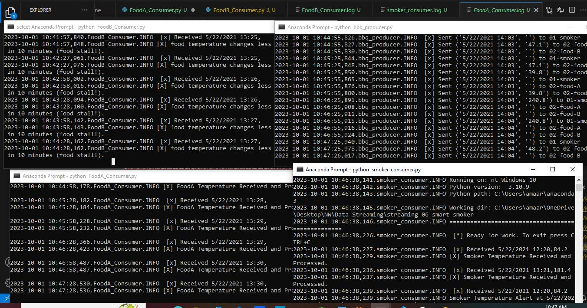
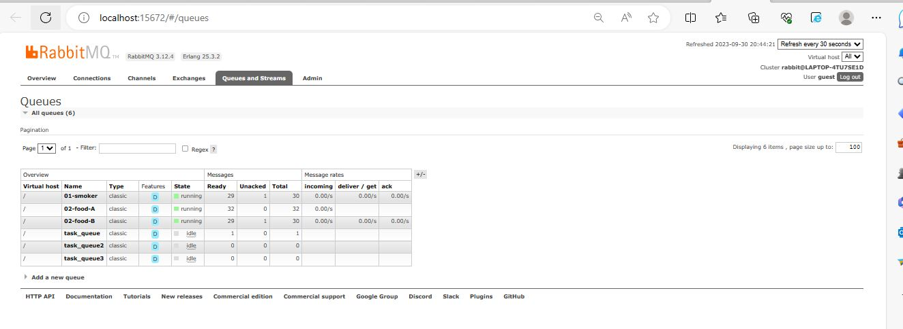
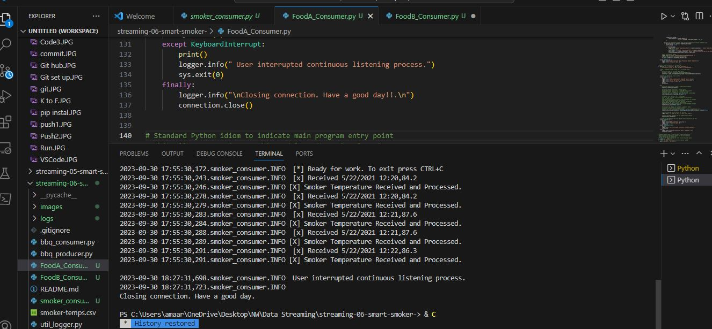
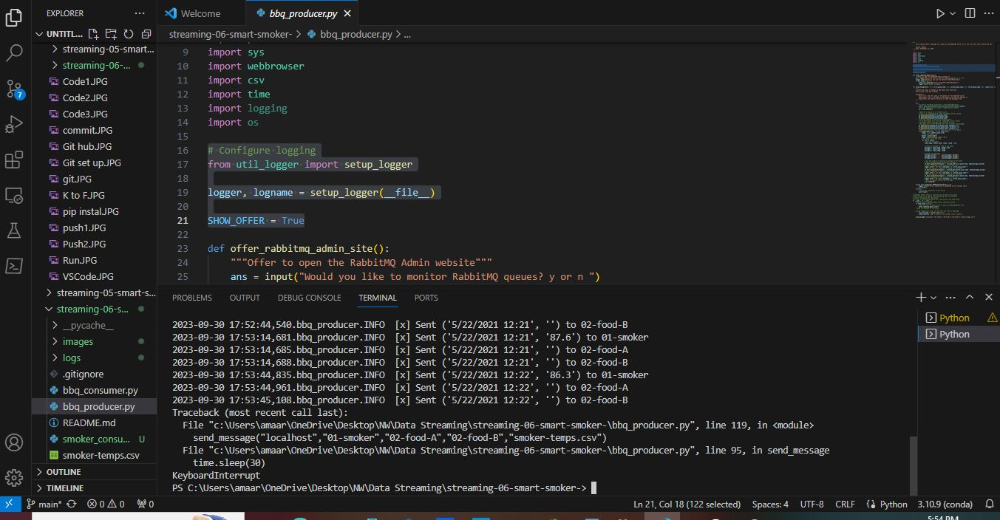

# streaming-06-smart-smoker-

> The assignment is implement data streaming for smart smoker system. to Get started with RabbitMQ, a message broker, that enables multiple Queue and reads the data from the CSV file at every 30 seconds.

## Prerequisites

1. Git
1. Python 3.7+ (3.11+ preferred)
1. VS Code Editor
1. VS Code Extension: Python (by Microsoft)
1. RabbitMQ Server installed and running locally

## Design and Implement Your Producer and Consumer

In GitHub, create a new repo as streaming-06-smart-smoker
Add a README.md 
Clone your repo down to your machine. 
Add a .gitignore.
Add the Smoker-temps csv data file to the repo. 
Create a file for your bbq producer.
Implemented bbq prod
Create 3 consumers

## Task 6. Execute the Producer/Consumer

1. bbq_consumer.py (and the tutorial)
2. smoker_consumer.py , FoodA_Consumer.py and FoodB_Consumer.py
1. Run the file. It will run, emit a message to the named RabbitMQ queue, and finish.
3. Execute commands in the Anaconda Prompt terminal to display the message. 

# Markdown and Visual Studio Code!
!RabbitMQ_queuerunning.JPG)

## Reference

- [RabbitMQ Tutorial - Hello, World!](https://www.rabbitmq.com/tutorials/tutorial-one-python.html)
- [Guided Producer Design](https://nwmissouri.instructure.com/courses/54849/pages/module-5-dot-1-guided-producer-design?wrap=1)
- [Producer Implementation](https://nwmissouri.instructure.com/courses/54849/pages/module-5-dot-2-guided-producer-implementation?wrap=1)
